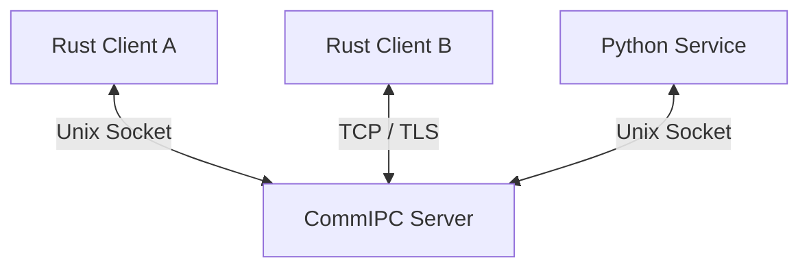
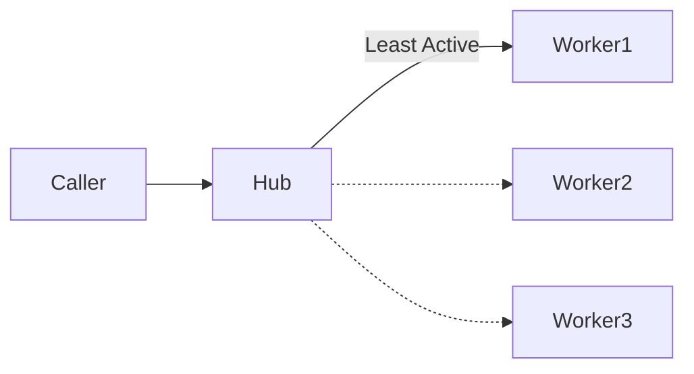

# Architecture Reference

## Core Topology
CommIPC follows a Hub-and-Spoke model where a central Server routes all traffic.

## Message Lifecycle (RPC)
1. **Client A** sends a `Call` message to the **Hub**.
2. **Hub** identifies the provider for the channel/event.
3. **Hub** forwards the `Call` to **Client B** (Provider).
4. **Client B** processes and sends a `Response` back to the **Hub**.
5. **Hub** matches the `request_id` and routes the `Response` back to **Client A**.

## Load Balancing (Groups)
When multiple providers register for the same event within a group, the Hub balances the load.

